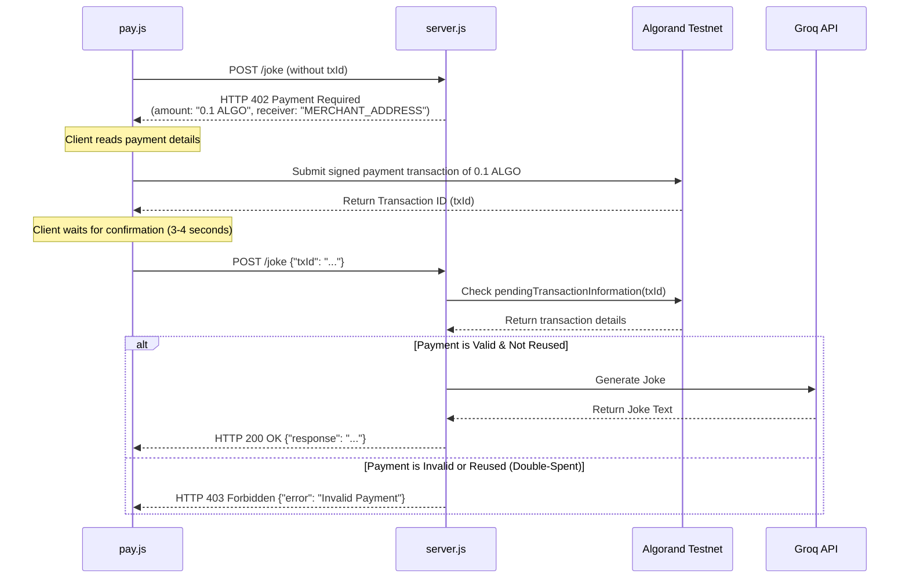

# Algorand-Paid AI Joke API

A premium Node.js Express API that serves artificial intelligence responses (jokes generated via Groq's Llama 3.3 model) guarded by an on-chain **HTTP 402 Payment Required** verification layer on the Algorand Testnet.

---

## ⚙️ How it Works (The HTTP 402 Workflow)



---

## 📁 File Structure

*   `server.js` - Express API server that implements Algorand transaction validation, double-spend check (in-memory), and Groq integration.
*   `pay.js` - Automated E2E test client that checks sender balance, builds, signs, and submits a 0.1 ALGO transaction, and calls the protected API.
*   `wallet.js` - Account generation helper to create new Merchant and User wallets.
*   `.env` - Secure configuration storing API keys and wallet secrets.

---

## 🚀 Getting Started

### 1. Install Dependencies
```bash
npm install
```

### 2. Generate Wallet Keys
Run the wallet generator script to create test accounts for the Merchant and the User:
```bash
node wallet.js
```
This automatically appends the address and secret mnemonic of both wallets to your `.env` file.

### 3. Fund the User Wallet
To perform payments, the User wallet needs Testnet ALGO:
1. Copy the `User Address` printed in your terminal or inside `.env`.
2. Go to the [Algorand Testnet Dispenser](https://bank.testnet.algorand.network/).
3. Paste the address, solve the captcha, and click **Dispense**.

### 4. Start the Server
Run the API server:
```bash
node server.js
```
The server will boot up and start listening on port `3000`.

### 5. Run the Test Client
In a new terminal window, execute the automated payment and request flow:
```bash
node pay.js
```

---

## 📬 API Endpoint Details

### **POST** `/joke`

#### **Request Body**
```json
{
  "txId": "DBC6SX5N4W22YTJFYCHLBBLASJBMYDJNV3QHOMWYR2VS5RR6DJUA",
  "prompt": "Tell me a physics joke" 
}
```

#### **Responses**

*   **`200 OK` (Successful payment)**:
    ```json
    {
      "response": "A man walked into a library and asked the librarian..."
    }
    ```
*   **`402 Payment Required` (Missing transaction ID)**:
    ```json
    {
      "error": "Payment Required",
      "amount": "0.1 ALGO",
      "receiver": "VHPGZIMP3SP4WHCFVA6SW7BJB7TYP4D6BEKVBK3C4FPSK7LHN6CNKNVXWU"
    }
    ```
*   **`403 Forbidden` (Invalid/already processed transaction)**:
    ```json
    {
      "error": "Invalid Payment"
    }
    ```
