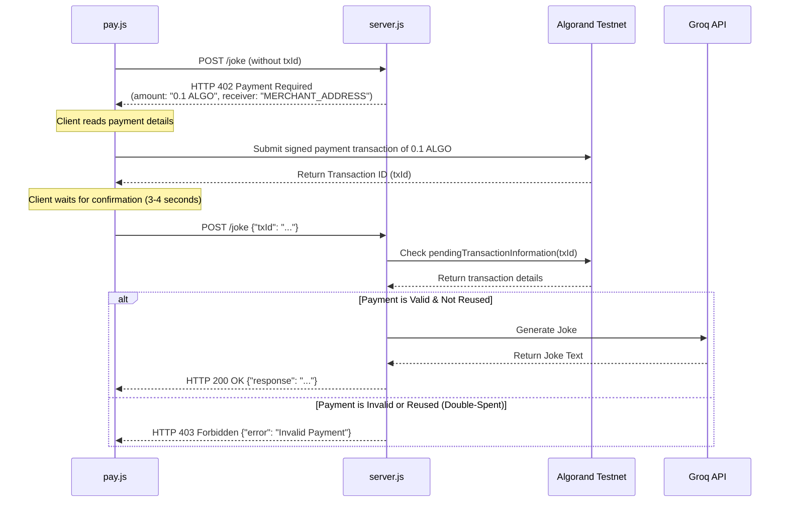

# Algorand-Paid AI Joke API

A premium Node.js Express API that serves artificial intelligence responses (jokes generated via Groq's Llama 3.3 model) guarded by an on-chain **HTTP 402 Payment Required** verification layer on the Algorand Testnet.

---

## ⚙️ How it Works (The HTTP 402 Workflow)



---

## 📁 File Structure

*   `server.js` - Express API server that implements Algorand transaction validation, double-spend check (in-memory), and Groq integration.
*   `pay.js` - Automated E2E test client that checks sender balance, builds, signs, and submits a 0.1 ALGO transaction, and calls the protected API.
*   `wallet.js` - Account generation helper to create new Merchant and User wallets.
*   `.env` - Secure configuration storing API keys and wallet secrets.

---

## 🚀 Getting Started & Testing

Follow these steps to configure, run, and test the payment-locked joke API locally.

### 📋 Prerequisites
- **Node.js** (v18 or higher recommended)
- **Groq API Key**: Get one from [Groq Console](https://console.groq.com/)

---

### 1. Install Dependencies
Clone the repository, navigate into the directory, and install the required NPM packages:
```bash
npm install
```

### 2. Configure Environment Variables
Create a file named `.env` in the root of the project and add your Groq API key:
```env
GROQ_API_KEY=your_groq_api_key_here
```
> [!NOTE]
> The remaining environment variables (`MERCHANT_ADDRESS`, `MERCHANT_MNEMONIC`, `USER_ADDRESS`, and `USER_MNEMONIC`) will be automatically generated and appended in the next step.

### 3. Generate Wallet Keys
Run the wallet generator script to automatically create Algorand Testnet credentials for both the **Merchant** and the **User**:
```bash
node wallet.js
```
This script will output the new addresses to the terminal and automatically write them into your `.env` file.

### 4. Fund the User Wallet
Because the client pays 0.1 ALGO for every joke request, the User wallet needs Testnet funds:
1. Open the `.env` file or look at the terminal output to copy the `USER_ADDRESS`.
2. Visit the [Algorand Testnet Dispenser](https://bank.testnet.algorand.network/).
3. Paste the address, complete the captcha, and click **Dispense** to receive free Testnet ALGO.

---

### 💻 How to Start the App
Start the Express API server on the host machine:
```bash
node server.js
```
The server will start listening at `http://localhost:3000`. Keep this process running.

---

### 🧪 How to Test the App
Open a **new terminal tab or window** and execute the client simulator:
```bash
node pay.js
```

#### What the test client does:
1. Queries the User wallet's current ALGO balance.
2. Initiates a payment of `0.1 ALGO` to the Merchant's address on the Algorand Testnet.
3. Submits the signed transaction to the blockchain network and waits for confirmation (~3-4 seconds).
4. Calls the `/joke` endpoint with the confirmed transaction ID (`txId`).
5. Prints the response joke returned by the server.

---

## 📬 API Endpoint Details

### **POST** `/joke`

#### **Request Body**
```json
{
  "txId": "DBC6SX5N4W22YTJFYCHLBBLASJBMYDJNV3QHOMWYR2VS5RR6DJUA",
  "prompt": "Tell me a physics joke" 
}
```

#### **Responses**

*   **`200 OK` (Successful payment)**:
    ```json
    {
      "response": "A man walked into a library and asked the librarian..."
    }
    ```
*   **`402 Payment Required` (Missing transaction ID)**:
    ```json
    {
      "error": "Payment Required",
      "amount": "0.1 ALGO",
      "receiver": "VHPGZIMP3SP4WHCFVA6SW7BJB7TYP4D6BEKVBK3C4FPSK7LHN6CNKNVXWU"
    }
    ```
*   **`403 Forbidden` (Invalid/already processed transaction)**:
    ```json
    {
      "error": "Invalid Payment"
    }
    ```
